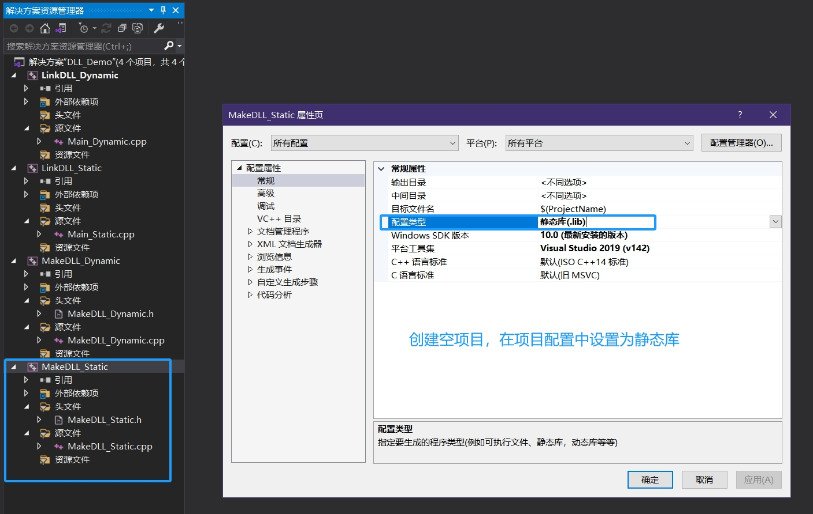
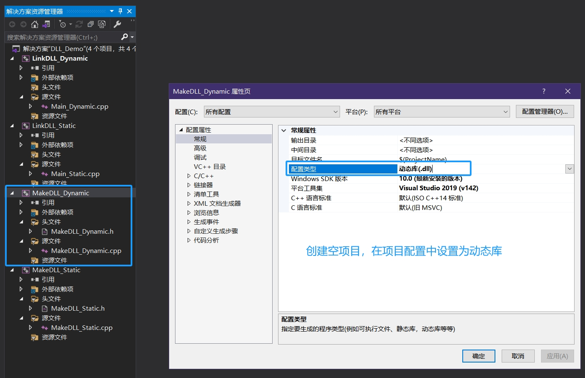
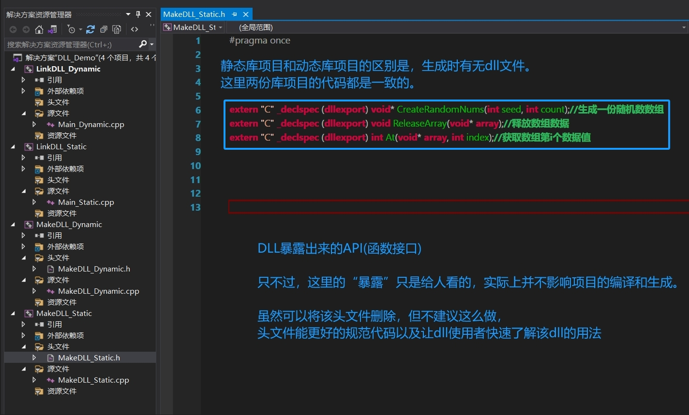
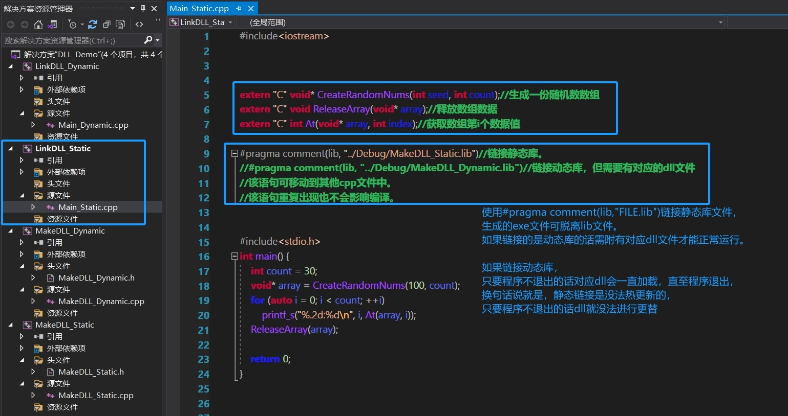
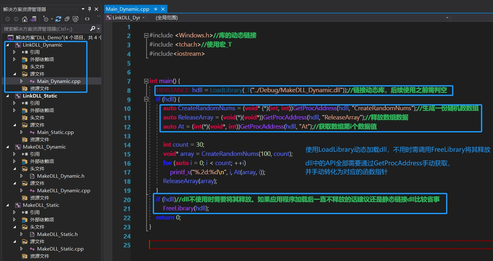
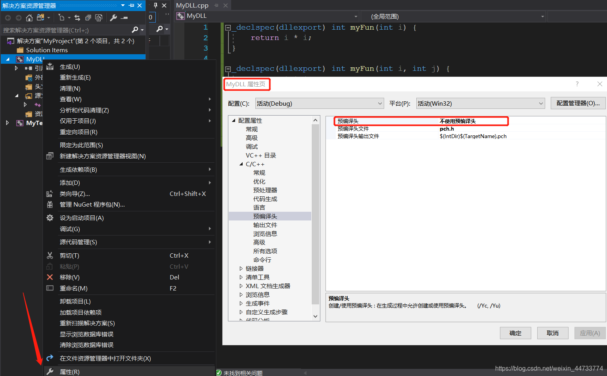
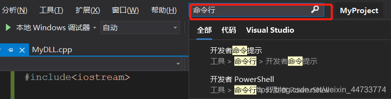
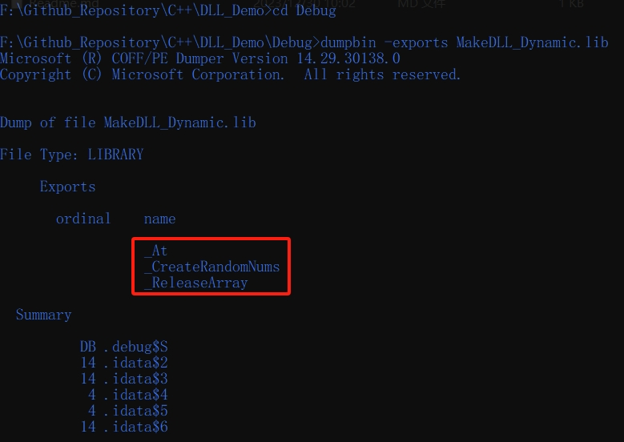

示例代码，仅作为学习使用

 

生成DLL以及链接DLL的两种方式(静态链接和动态链接)
因为静态库和动态库相差不大所以这里顺便提一下静态库

IDE使用的是VS2019，平台为win10

 

***

# 1、创建库项目

***

# 2、编写库项目代码
根据需要，可以添加DllMain函数设置动态库加载时的行为：[DllMain 入口点](https://learn.microsoft.com/zh-cn/windows/win32/dlls/dllmain)。
本示例并不介绍和使用入口点函数

使用``_declspec(dllexport)``声明暴露函数API，没有该声明的函数仅能在本dll中调用，这有点类似于``static``和``extern``声明。
通过``_declspec(dllexport)``将dll的全局变量暴露出去的做法可以是可以，但不是那么建议

DLL项目也是可以加载dll文件，但貌似有很多副作用？没经过测试，这里暂按不表。

 

***

# 3、运行库项目生成lib/dll文件

***

# 4-1、静态链接库文件

 

***

# 4-2、动态链接库文件

 
 
 

***

# 其他补充：

## 1.库项目的预编译头问题
在项目中设置“不使用预编译头”即可

 

## 2.查看lib/dll文件中的内容
可以使用VS2019自带的lib/dll查看器，也可以在网上搜索下载其他查看器。
在VS2019中，打开命令行窗口，并切换到对应目录下使用``dumpbin -exports FILE``进行查看。

 

## 3.库项目代码规范：

#### 3-1、强烈建议附上``extern "C"``声明为C式函数

因为C++式函数会因为实现函数重载原因会对函数名进行更改，而改成什么样与编译器强相关：[C++编译器的函数名修饰规则](https://www.cnblogs.com/yxysuanfa/p/6984895.html) 

也就是如果生成库文件的编译器与使用库文件的项目的编译器发生不一致将直接报错，最常见的例子就是VS2019生成的dll文件无法投入到Qt开发中。

而且刨去这层原因外，C式dll能通用于其他编程语言(例如py、c#)，而C++式dll无法顺利使用(因为函数名被改的太奇怪了) 

除非你的dll确信是
- 只用于C++
- 使用的是同个IDE

即使如此也强烈不建议使用C++式函数，因为实际上也没那么多的场合需要使用函数重载。

 

#### 3-2、函数规范

dll函数接口的参数和返回值类型均是C语言的数据类型，也就是没有“字典”、“列表”之类的数据结构。

虽然这么说但实际上你可以返回这些数据结构的``void*``指针(而本示例就是这么做的，主要是偷懒)，但是，虽说返回``void*``指针但不代表你的exe项目可以直接对这个``void*``指针强转为对应数据结构并进行使用(这非常危险且不可理喻)。

直白的说就是，dll中使用的数据结构是无法直接暴露到外界中的，必须通过dll中的函数访问对应的数据内容，除非**使用的是C式数据结构struct**(可参考Windows编程)，这种情况下就可以直接在exe项目中对``void*``指针强转为对应数据结构。

尽管如此也是麻烦不断，增大了项目间的耦合，对后面的开发造成无尽麻烦，除非有把握确信“该数据结构是万年不变的”，要不然也是不建议这么做，万一数据结构发生变动的话所有关联项目都需要进行小幅度修改，严重的话可能需要对所有项目进行“重构”。

 

本示例中的``CreateRandomNums``生成``vector<int>``容器，返回的是该容器的指针，
通过``At``函数访问该容器的对应数据(而不是强转为``vector<int>*``，再次强调，这非常危险且不可理喻)。

 

#### [2024/4/24]额外补充：

上面的一些观点有表述问题，在此勘误，并新增两个DLL测试项用于测试有结构体``struct``参与的dll函数，分别是MakeDLL_StructData和LinkDLL_StructData。
1. 对于C以外的东西，或者说C++特有的东西，例如类(vector<int>)等，放进dll并暴露出来的直接下场都是暴毙，这没得说的，但如果使用的是C的结构体数据则可以进行强转，前提是设置好一模一样的数据结构，并且还得看语言的支持情况，例如Python虽然支持结构体，但对于一些特殊情况(例如结构体有“位域”数据)则直接说明是“一种未定义行为”；
2. 在本项目中附加了Python对dll的调用测试样例，路径为[./LinkDLL_StructData/LinkDLL_StructData.py](./LinkDLL_StructData/LinkDLL_StructData.py)
3. 有的观点依旧认为返回指针是一件不妥的事，嘛，我持中立意见，毕竟我也不能打包票说绝对不会对dll返回的指针进行强转/解析来获取数据，是有那么一些应用场景呢？
4. dll的数据指针需秉承“打哪来回哪去”的原则，从dll中生成的堆变量必须由dll释放；

 

#### 其他参考：
- Linux下的静态库/动态库：[https://blog.csdn.net/weixin_47826078/article/details/120474883](https://blog.csdn.net/weixin_47826078/article/details/120474883)
- C#调用DLL的几种方法，包括C#调用C\C++\C#DLL：[https://zhuanlan.zhihu.com/p/72450434](https://zhuanlan.zhihu.com/p/72450434)
- ctypes-结构体和联合：[https://docs.python.org/zh-cn/3.7/library/ctypes.html#structures-and-unions](https://docs.python.org/zh-cn/3.7/library/ctypes.html#structures-and-unions)

 

